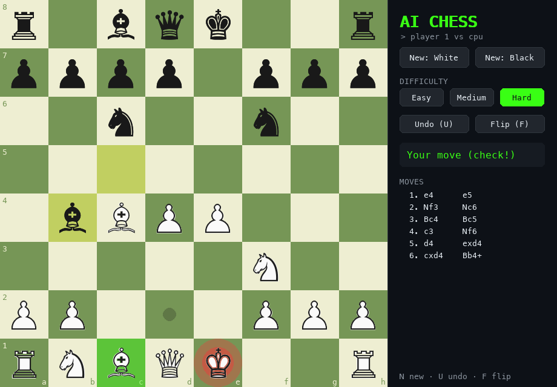

# AI Chess

Play chess against a computer opponent I wrote from scratch in Python: the rules engine, the search AI and the game window. No chess libraries.



## Play

Needs Python 3.9 or newer.

```bash
pip install -r requirements.txt     # just pygame, for the window
python3 play.py                     # play White at medium level
python3 play.py --color black --level hard
python3 play.py --text              # play in the terminal, no pygame needed
```

**In the window:** click a piece and then a square, or drag it. Legal moves show as dots, the last move is highlighted, and a king in check glows red. When a pawn reaches the last rank, you pick the piece it becomes.

| Key | Action |
|---|---|
| `N` | New game |
| `U` | Undo your last move (and the AI's reply) |
| `F` | Flip the board |
| `1` `2` `3` | Easy / medium / hard |
| `Esc` | Quit |

**In the terminal:** type moves in algebraic notation (`e4`, `Nf3`, `O-O`, `exd5`, `e8=Q`) or as squares (`e2e4`). `undo` and `quit` also work.

## Difficulty

| Level | Thinks for | Plays like |
|---|---|---|
| Easy | 0.3 s, 1 move ahead | Grabs material but misses tactics, and often picks a random decent move. |
| Medium | up to 1 s, 4 moves ahead | Solid. Sees most two-move tactics. |
| Hard | up to 3 s, about 6 moves ahead | Punishes mistakes. Finds forced mates. |

## How it works

### Rules (`chess_engine.py`)
- **Board:** a 10×12 "mailbox" array. The 8×8 board sits in the middle of a border of off-board cells, so a sliding piece stops as soon as it hits the border and no edge checks are needed.
- **Moves:** every chess rule is covered: castling (not out of, through or into check), en passant, promotion to any piece, pins, checkmate, stalemate, and draws by threefold repetition, the 50-move rule and insufficient material.
- **Undo:** `push()` makes a move and `pop()` restores the exact previous position. The AI uses this millions of times per game instead of copying the board.
- **Hashing:** each position has a 64-bit Zobrist hash, updated move by move, for spotting repetitions quickly.
- **Notation:** reads and writes FEN, standard algebraic notation (with `Nbd7`-style disambiguation, `+` and `#`) and UCI.

### AI (`ai.py`)
1. **Negamax with alpha-beta pruning** skips lines that can't affect the result.
2. **Iterative deepening:** it searches 1 move ahead, then 2, then 3, until time runs out, and keeps the best move from the last finished depth.
3. **Move ordering:** the best move from the previous depth goes first, then captures of valuable pieces by cheap ones. Alpha-beta prunes far more when good moves come first.
4. **Transposition table:** positions reached by different move orders are only searched once.
5. **Quiescence search:** at the end of each line it keeps playing out captures, so it never stops counting right before losing its queen.
6. **Evaluation:** material plus piece-square tables. These reward central knights, advanced pawns and a castled king, and the king switches to an endgame table that pulls it toward the center.

Easy and medium add some randomness by choosing among moves that score close to the best, so they're beatable and don't play the same game every time.

### Window (`gui.py`)
Built with pygame. The AI thinks on a background thread so the window stays responsive. Pieces are drawn from the chess symbols in your system font, so there are no image files to lose. If no installed font has the symbols, it falls back to lettered tokens.

## Tests

```bash
python3 -m unittest -v           # 40 tests; GUI tests skip if pygame is missing
SLOW=1 python3 -m unittest -v    # also the deeper move-count checks
```

The rules are checked with **perft**: counting every position reachable in N moves from well-known test positions and comparing against published totals (for example, 197,281 positions after 4 moves from the start). Any bug in castling, en passant, promotion or pins would change those numbers. The tests also cover the AI (mates in one and two, winning material, not hanging pieces) and drive the window with simulated clicks and drags.

## History

This picks up the chess AI I started in [AI-project](https://github.com/Afaguayo/AI-project), a pygame board with a minimax AI. That version never ran for anyone else, because its piece images weren't in the repo, and it didn't handle check or checkmate. This one is complete.
